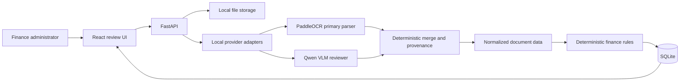

# Target architecture

Invoice Review will be built as a small local full-stack application. The learner starter intentionally contains only a FastAPI health endpoint and a React landing screen.

## Intended boundaries

- Provider adapters normalize PaddleOCR and local VLM responses before data reaches the domain.
- PaddleOCR remains the primary evidence source; the VLM is an independent reviewer and generator, not a business-rules engine.
- Deterministic invoice and receipt rules remain separate from model extraction.
- Routes own HTTP concerns, a service owns orchestration, and a repository owns SQLite access.
- Environment values are read through one backend settings module and one frontend environment module.
- A person approves, rejects, or requests a supplier correction after seeing evidence and uncertainty.

## Local provider choices

- **Primary parser:** PaddleOCR PP-StructureV3 for OCR, layout, tables, boxes, and confidence values. PaddleOCR-VL is an optional parser for difficult multilingual layouts.
- **Independent VLM:** Qwen2.5-VL-7B-Instruct for document review, GL suggestions, and correction-email drafts.
- **Runtime:** Ollama for local development or vLLM for a GPU-backed OpenAI-compatible service.
- **Provider boundary:** PaddleOCR, Ollama, vLLM, and model-specific response types stop in `backend/app/providers/`. Only normalized provider-independent models cross into the domain.

The local parser may render PDF pages to images before sending them to the VLM. This preprocessing stays inside the provider adapter and does not change the original uploaded document or the normalized domain contract.

## Target flow

## Starter checkpoint

The backend exposes `GET /health`, the frontend renders the starter screen, the fictional corpus is available under `samples/`, and no completed review workflow exists on `main`.
